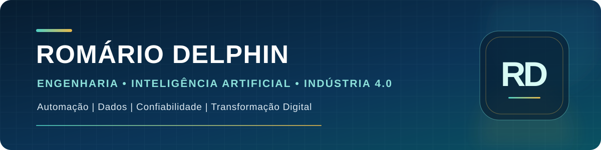

  

<h1 align="center">Romário Queiroz Delphin</h1>

  <strong>Engenheiro de Computação · Graduado em Inteligência Artificial · MBA em Engenharia Industrial 4.0</strong> 
  <strong>Mestrando em Gestão Pública e Relações Institucionais</strong>

  <a href="https://romariodelphin.github.io/">Portfólio profissional</a> ·
  <a href="https://www.linkedin.com/in/romariodelphin/">LinkedIn</a>

---

## Perfil profissional

Transformo problemas operacionais e institucionais em **sistemas, automações e produtos digitais mensuráveis**. Minha atuação conecta Engenharia da Computação, Inteligência Artificial, Indústria 4.0, dados, confiabilidade de ativos e gestão de processos.

Tenho experiência nos setores de **agronegócio, indústria, tecnologia e administração pública**, com passagem por Cargill, Storaze, inpEV, CR Agro e Câmara Municipal de Querência. Essa trajetória permite unir visão técnica, realidade operacional, governança e resultado de negócio.

### Proposta de valor

| Inteligência Artificial | Engenharia Industrial 4.0 | Transformação Digital | Gestão e Governança |
| --- | --- | --- | --- |
| Agentes de IA, RAG, OCR e automação documental | Manutenção preditiva, IoT, vibração e termografia | Integração de sistemas, automação e arquitetura de dados | KPIs, rastreabilidade, compliance, OPEX/CAPEX e liderança |

> Tecnologia deve ampliar a capacidade humana, produzir evidências verificáveis e gerar resultados sustentáveis.

## Projetos

| Projeto | Problema enfrentado | Tecnologias e competências |
|---|---|---|
| [Portal Professor Neiriberto Abner](https://github.com/RomarioDelphin/portal-neiriberto-abner) | Mandato digital, transparência, notícias e produção legislativa integrada | Blogger XML, JavaScript, SAPL API, SEO |
| [Tema Câmara de Querência](https://github.com/RomarioDelphin/tema-camara-querencia-portal-modelo) | Modernização de portal legislativo e serviços ao cidadão | Plone, Diazo, JavaScript, SAPL API, acessibilidade, LGPD |
| [Agentes de IA + SAPL](https://github.com/RomarioDelphin/agentes-ia-sapl) | Análise documental e fiscalização com rastreabilidade e supervisão humana | IA generativa, RAG, OCR, SAPL, governança de IA |
| **Emissor de Certificados** *(privado)* | Emissão e validação de certificados de palestras | React, TypeScript, Supabase, QR Code |
| [Fiscal Risk AI](https://github.com/RomarioDelphin/Consulta-de-CNPJ-com-Analise-IA) | Consulta empresarial, regras de risco e apoio à conformidade | Python, Flask, APIs, regras de negócio, dados públicos |
| [CNPJ Intelligence](https://github.com/RomarioDelphin/consultacnpj) | Protótipo client-side para consulta de dados empresariais | HTML, CSS, JavaScript, ReceitaWS |
| [BarberFlow](https://github.com/RomarioDelphin/barberflow) | Gestão e agendamento SaaS com automação de relacionamento | React, Flask, PostgreSQL, Docker, n8n |
| [Sentinela Industrial](https://github.com/RomarioDelphin/Sentinela_Industrial) | Predição de falhas e apoio à confiabilidade de ativos | Python, Machine Learning, Streamlit, IoT |
| [Engine.OS](https://github.com/RomarioDelphin/Gerador-de-Informacoes) | Geração de dados sintéticos para testes e homologação | HTML, CSS, JavaScript, algoritmos de validação |
| [Portfólio profissional](https://github.com/RomarioDelphin/RomarioDelphin.github.io) | Apresentação de trajetória, cases, publicações e serviços | HTML, CSS, JavaScript, SEO, design responsivo |

## Cases e resultados

- **IA aplicada ao processo legislativo:** estruturação de fluxo supervisionado para análise de Diários Oficiais, empenhos, contratos e proposições, com rastreabilidade até a fonte.
- **Processamento preliminar acelerado:** case documentado de redução de aproximadamente 48 horas de análise intermitente para cerca de 45 segundos de processamento inicial, mantendo validação humana.
- **Confiabilidade industrial:** aplicação de dados de temperatura, vibração e rotação para classificação de risco de falha e apoio à manutenção preditiva.
- **Automação de processos:** desenvolvimento de aplicações e integrações voltadas a atendimento, compliance, gestão, dados e serviços ao cidadão.

## Experiência multidisciplinar

- **Tecnologia, inovação e processos — setor público** · 2024–atual
- **Consultoria de Tecnologia e Processos Operacionais — CR Agro** · 2024
- **Gerência de Unidade e Supervisão de Central — inpEV** · 2022–2024
- **Análise de Suporte de Sistemas — Storaze** · 2020–2021
- **Análise Regional de Operações — Cargill** · 2017–2019

Minha base operacional inclui liderança, melhoria contínua, suporte a sistemas, rastreabilidade, confiabilidade, análise de dados, indicadores e transformação de processos.

## Formação e credenciais

- **Mestrado em Gestão Pública e Relações Institucionais** · em andamento
- **Graduação em Inteligência Artificial — UNIFAEL** · concluída
- **MBA em Engenharia Industrial 4.0** · 2023
- **Bacharelado em Engenharia de Computação** · 2022
- **Pós-graduação em Liderança e Gestão de Pessoas** · 2021
- **Associate Cloud Engineer — Google Cloud**
- Formação complementar em **Inteligência Artificial no Setor Público**

## Competências técnicas

**IA e dados:** Python, Machine Learning, agentes de IA, RAG, OCR, engenharia de prompts, APIs, análise e governança de dados.

**Engenharia e operações:** manutenção preditiva, confiabilidade operacional, vibração, termografia, lubrificação industrial, SAP, IoT industrial, MTBF, MTTR e disponibilidade.

**Software e automação:** JavaScript, HTML, CSS, Flask, React, PostgreSQL, Docker, n8n, integração de sistemas e aplicações responsivas.

**Gestão:** transformação digital, KPIs, P&L, OPEX/CAPEX, compliance, melhoria contínua, liderança e desenvolvimento de equipes.

## Publicações

- **Agro 5.0** — arquitetura de dados, automação e tomada de decisão no agronegócio.
- **A Revolução Silenciosa** — Inteligência Artificial, transformação digital e novos modelos de gestão.

## Atuação profissional

Tenho interesse em projetos, consultoria, liderança técnica, palestras e desenvolvimento de soluções nas áreas de:

- Inteligência Artificial aplicada a problemas reais;
- Engenharia Industrial 4.0 e confiabilidade;
- automação e integração de processos;
- arquitetura e governança de dados;
- transformação digital no agronegócio, indústria e setor público;
- produtos digitais com impacto operacional mensurável.

---

  <strong>Querência, Mato Grosso, Brasil</strong> 
  <a href="https://romariodelphin.github.io/">Portfólio</a> ·
  <a href="https://www.linkedin.com/in/romariodelphin/">LinkedIn</a> ·
  <a href="https://github.com/RomarioDelphin?tab=repositories">Projetos no GitHub</a>

